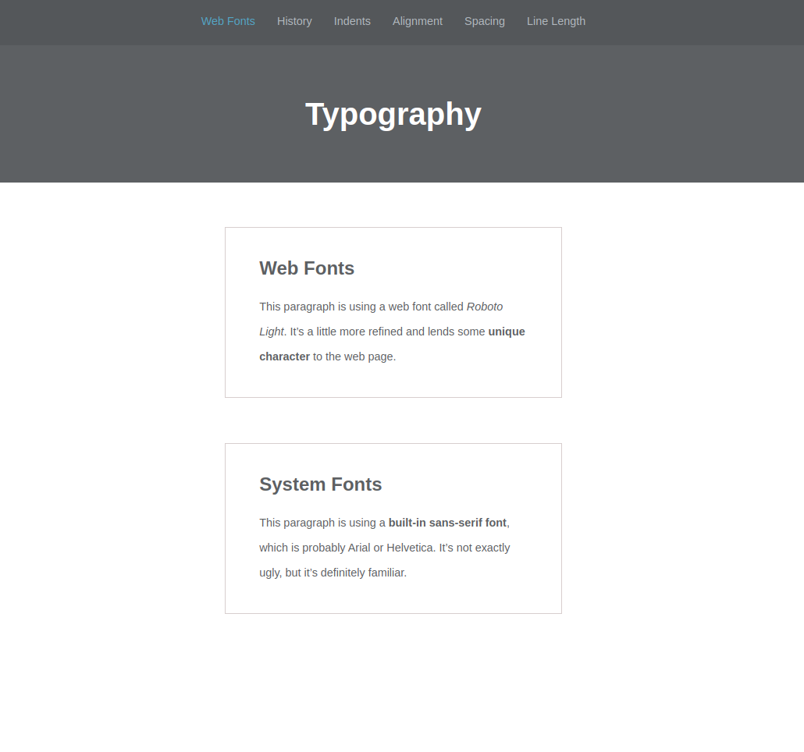
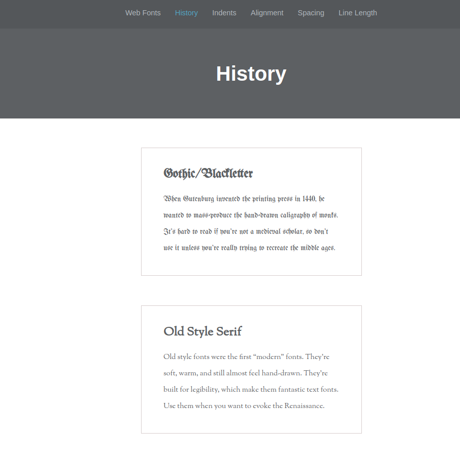
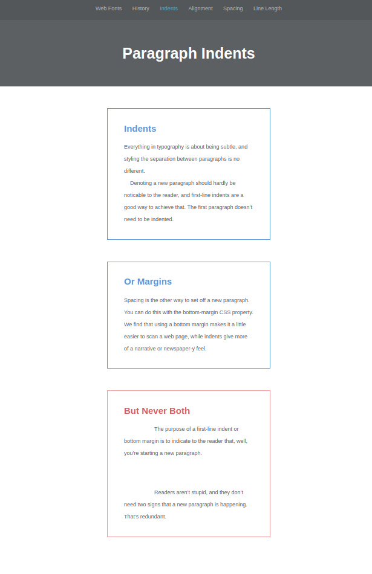

# Typography-demo

## Table of contents

- [Overview](#overview)
  - [Links](#links)
  - [Challenge](#challenge)
  - [Screenshot](#screenshot)

  - [My process](#my-process)

  - [Built with](#built-with)

  - [Author](#author)

## Overview

### challenge

demo on web typography that examines:

- web vs system fonts
- history of fonts
- text alignment
- proper indendation, spacing, and line length.

### Links

- Live Site URL: [https://saadmalik200.github.io/Typography-demo/](https://saadmalik200.github.io/Typography-demo/)

### Screenshot

#### Web Font Page

#### History Page

#### Indent Page

## My process

### Built with

- Semantic HTML5 markup
- CSS custom properties
- Google Fonts

## Author

- Website - [Saad Malik-Github](https://github.com/saadmalik200)

